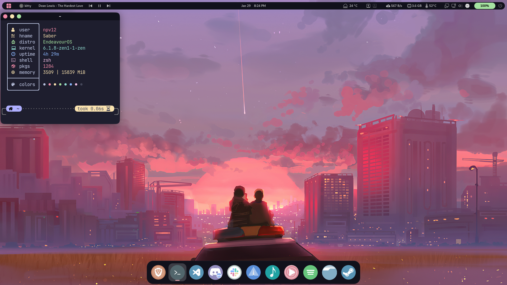
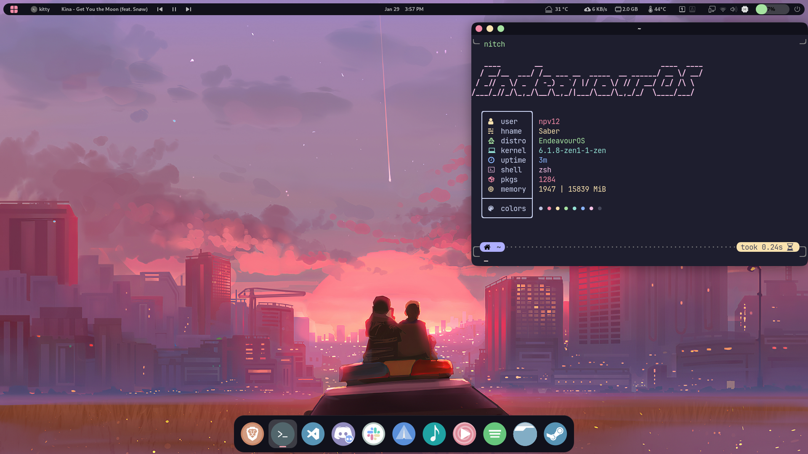
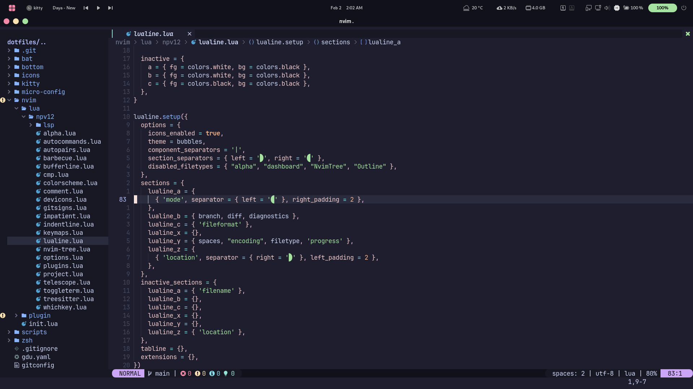

# Dotfiles

<mark>Warning: Don’t blindly use my settings unless you know what that entails. Use at your own risk!</mark>

Just my own set of dotfiles to backup and easily restore onto a new system. This is meant for a gnome based desktop environment with arch as the linux base.

## Components

There's a few special files in the hierarchy.

- **scripts**:- Include some useful scripts to automate stuffs.
- **zsh**:- It makes use of [zsh4humans](https://github.com/romkatv/zsh4humans)
- **nvim**:- The base for the setup was taken from [lunarnvim](https://github.com/LunarVim/Neovim-from-scratch) but has been modified for my needs.
- **icons**:- Includes bibata modern ice theme which was downloaded from [pling](https://www.gnome-look.org/p/1197198)

## install

Run this:

```sh
git clone https://github.com/npv12/dotfiles.git
cd ~/dotfiles
script/setup.zsh
```

This will symlink the appropriate files in `dotfiles` to your home directory.
Everything is configured and tweaked within `~/dotfiles`.

## Screenshots
* Gnome desktop
<p align="center">
  
  
</p>
* nvim
<p align="center">
  
</p>

## Thanks
* A lot of the dotfiles contains colorschemes which were blatantly kanged from [Catppuccin](https://github.com/catppuccin).
* [Lunar nvim](https://github.com/LunarVim/)
